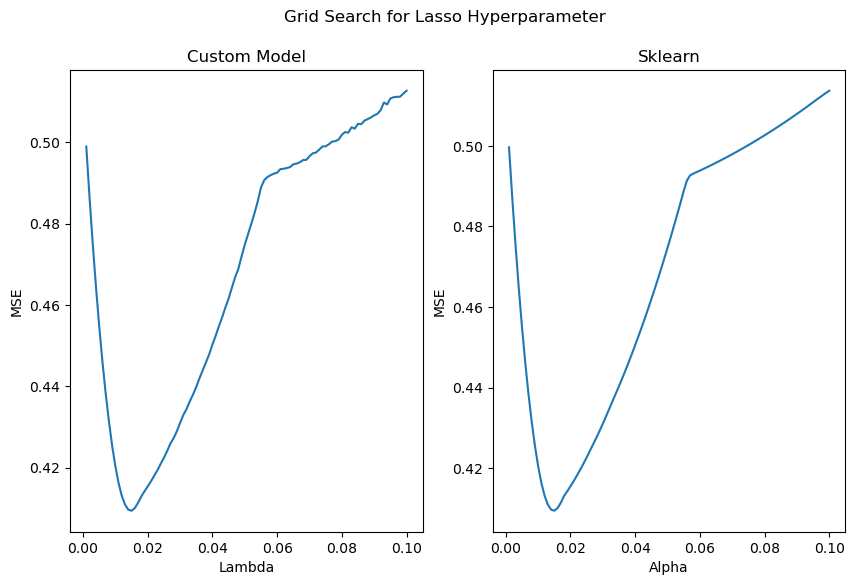

# ML Algorithms

## Overview

This project aims to replicate standard machine learning models from scratch using only NumPy. Models created include: OLS, ridge and lasso regression, KNN and logistic regression. The models are then compared against sklearn's packages in a demo notebook.

## Results

- OLS and ridge regression models achieved coefficients that differed by less than `1e-14`.
- Ridge model returned the same hyperparameter as sklearn's
- Lasso model achieved coefficients within `1e-2` of sklearn's
- KNN model achieved 100% identical predictions on test dataset to sklearn's
- Logistic regression achieved 100% identical predictions on test dataset to sklearn's
- Logistic regression loss function with `1e-2` of sklearns
- Logisitc regression coefficients substantially different to sklearns (order of magnitude `1e2`) despite similar predictions

## Data

The notebook uses sklearn's built in datasets `fetch_california_housing` and `load_breast_cancer` for regression and classification problems respectively. The notebook will retrieve this data automatically.

## Requirements

python 3.11.15

## How to Run

1. Clone the repo:
  `git clone https://github.com/ccbarnesni-source/Portfolio`
2. Navigate to the appropriate subfolder:
  `cd Portfolio/ML-Algorithms`
3. Install dependencies
  `pip install -r requirements.txt`
4. Open the notebook
    - In VS Code: run `code .` and then select the notebook `Demo-Notebook.ipynb` from the explorer.
    - In Jupyter: run `jupyter notebook` and navigate to the notebook.
5. Run all cells  

  Note: the cross-validation loop for lasso can take up to 20 minutes to run depending on your device's capabilities.
