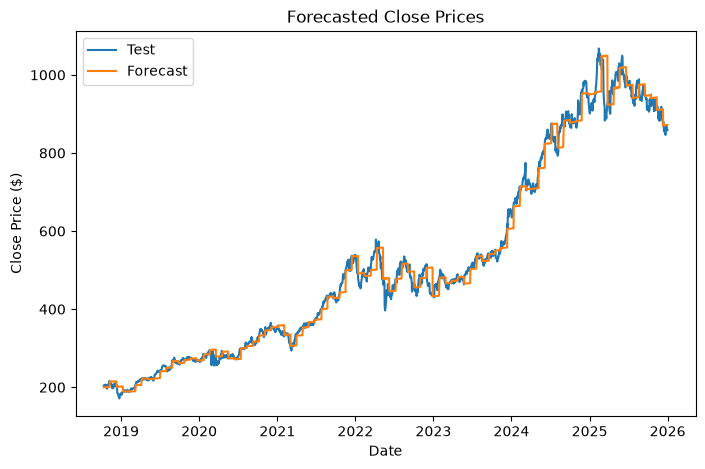

# Stock Price Prediction

## Overview

This notebook aims to address whether or not ARIMA models can outperform random guessing in predicting the direction of stock price movements. We examine the close prices of COST from 1990 to 2025 and fit a simple ARIMA model to this. The model is trained on the initial 80% of the data and used to predict subsequent time intervals. The model is retrained on the new data after each validation window. Directional accuracy is measured and a Pesaran-Timmermann test is conducted to compare this to the null hypothesis that the model is no better than random guessing. A directional accuracy score of 54.99% is obtained with a p-value of 0.03, indicating simple ARIMA models do offer a small, but meaningful predictive power.

## Key Findings

  - Directional accuracy: 54.99%
  - p-value 0.032
  - ARIMA models have a small, but statistically significant predictive power

## Data

The yfinance API is used to retrieve Costco (COST) stock closing prices from 1990 to 2025. Notebook retrieves data automatically upon execution.

## Requirements
python 3.11.15

## How to Run

1. Clone the repo:
  `git clone https://github.com/ccbarnesni-source/Portfolio`
2. Navigate to the appropriate subfolder:
  `cd Portfolio/Stock-Price-Prediction`
3. Install dependencies
  `pip install -r requirements.txt`
4. Open the notebook
    - In VS Code: run `code .` and then select the notebook `Stock-Price-Prediction.ipynb` from the explorer.
    - In Jupyter: run `jupyter notebook` and navigate to the notebook.
5. Run all cells  

  Note: the walk-forward validation loop at the end can take up to $\approx 6$  minutes to run if updating every 20 trading days depending on your device's capabilities.

